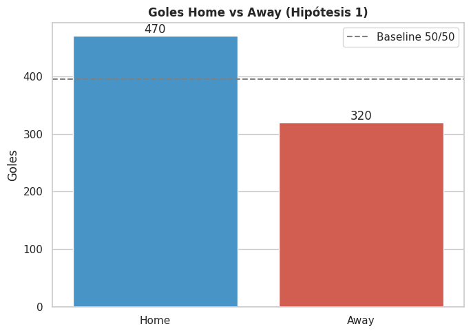
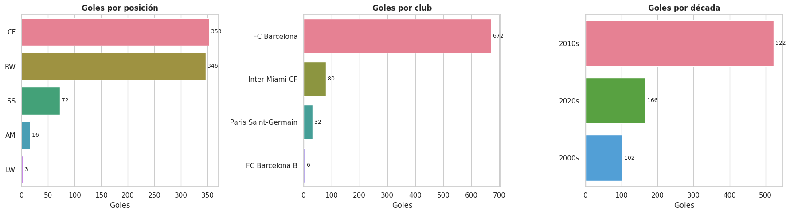
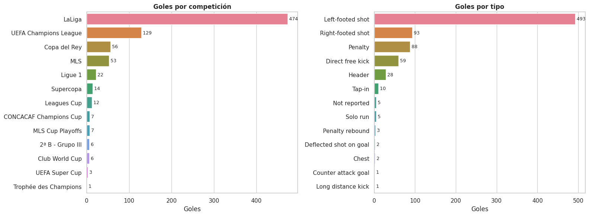
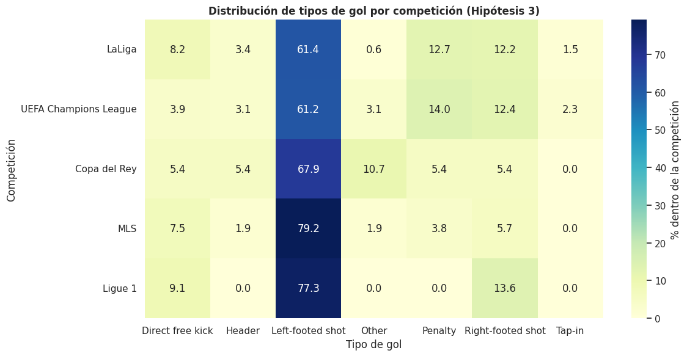
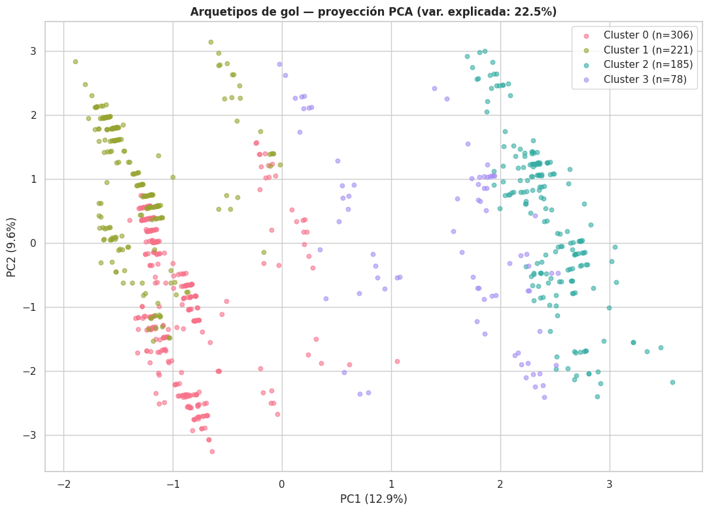

# Reporte EDA — `messi_all_goals.csv`

**Generado:** 2026-05-09
**Fuente:** `analysis_messi_all_goals.ipynb`
**Versión del dataset:** sha256 `6eaeec485ced` · 790 filas × 16 columnas
**Reporte de calidad previo:** 🟢 (ver `quality_report_messi_all_goals.md`)

---

## 1. Resumen ejecutivo

> **TL;DR:** Sobre 790 goles oficiales de Messi (2004–2026), **el 59.5% se marcan como local (`Home`)** y **cuatro arquetipos contextuales** explican la producción — la era FC Barcelona / LaLiga concentra el 85% del total y fija el patrón.

- Messi marca como local en **470/790 goles (59.5%)** frente a 320 (40.5%) como visitante; el test binomial vs un baseline 50/50 da `p ≈ 1.06×10⁻⁷` (significativo con margen amplio).
- **FC Barcelona aporta 672/790 (85.1%)** del dataset; **LaLiga 474 (60.0%)** y el **zurdazo (`Left-footed shot`) 493 (62.4%)** son las modas dominantes en club, competición y tipo de gol.
- Un K-Means con `k = 4` separa cuatro arquetipos por contexto: *liga local* (38.7%), *liga visitante* (28.0%), *Champions* (23.4%) y *post-Barça* (9.9%). En los cuatro el `top_goal_type` sigue siendo el zurdazo.
- El minuto del gol **no depende de la posición** del jugador (Kruskal-Wallis `p = 0.93`): el *cuándo* del gol es uniforme; lo que segmenta a Messi como goleador es el *dónde* y el *contra quién*.

## 2. Contexto y pregunta

El dataset compila los **790 goles oficiales** de Lionel Messi entre el **2004-09-05** (su primer gol en FC Barcelona B) y el **2026-03-07** (etapa Inter Miami CF). Cubre 22 temporadas, 13 competiciones, 4 clubes y 5 posiciones distintas. La pregunta exploratoria es **describir la firma goleadora de un jugador de carrera única**: cuándo marca, contra quién, cómo, y cómo se reordenan los patrones a lo largo de las eras (FC Barcelona B → FC Barcelona → PSG → Inter Miami).

## 3. Vista general de los datos

- **Tamaño:** 790 filas × 16 columnas, cubriendo del 2004-09-05 al 2026-03-07 (≈22 años).
- **Calidad:** **0.0% missing global**, 0 filas duplicadas — el reporte de calidad previo califica el dataset en 🟢 sin bloqueantes.
- **Decisiones de limpieza aplicadas:**
  - `date` parseada a `datetime` durante la carga.
  - `match_score` y `score_at_goal` descompuestos en pares de enteros con un parser robusto (0 fallos en 790 filas).
  - `match_stage` enriquecida con la bandera derivada `is_knockout` para distinguir jornadas de liga (números) de rondas de copa/UCL — **235/790 (29.7%)** son rondas knockout o group stage.
  - `assist_player` (87 únicos) agrupado en *top-15 + Other* para visualización; 175 goles caen en "Other".
  - Confirmada redundancia entre `venue` y `is_home_goal`: se trabaja con `is_home_goal` (booleano).

## 4. Hallazgos principales

### 4.1 Messi marca casi 6 de cada 10 goles como local

De los 790 goles, **470 se anotaron como local (59.5%) y 320 como visitante (40.5%)**. Un test binomial de dos colas contra el baseline 50/50 da **`p = 1.06×10⁻⁷`**, rechazando H0 con margen amplio. La diferencia de ~9 puntos porcentuales sobre el equilibrio teórico es consistente con la ventaja de localía documentada en el fútbol profesional (afluencia, condiciones conocidas, ausencia de viaje).

**Evidencia:** test binomial one-sample, two-sided, `n = 790`, `p_obs = 0.595`, `p-value = 1.06e-07`.



### 4.2 La era FC Barcelona / LaLiga concentra el 85% de la producción

**FC Barcelona** aporta **672/790 = 85.1%** de los goles, seguida muy de lejos por Inter Miami CF (80, 10.1%), Paris Saint-Germain (32, 4.1%) y FC Barcelona B (6, 0.8%). **LaLiga** es la competición dominante con **474 goles (60.0%)**, seguida por UEFA Champions League (129, 16.3%) y Copa del Rey (56, 7.1%). La temporada con mayor producción individual es **2011-12 (73 goles)**.

**Evidencia:** `value_counts` sobre las columnas `club`, `competition` y `season` (cell 5 y 16 del notebook).



### 4.3 El zurdazo es la firma técnica: 6 de cada 10 goles

El tipo de gol `Left-footed shot` aparece en **493/790 = 62.4%** de las anotaciones, seguido de lejos por `Right-footed shot` (93, 11.8%), `Penalty` (88, 11.1%), `Direct free kick` (59, 7.5%) y `Header` (28, 3.5%). La imagen popular de Messi como rematador-zurdo de área está respaldada por el dataset con margen amplio: el segundo modo de gol llega a una quinta parte del primero.

**Evidencia:** `value_counts` sobre `goal_type` (cell 15).



### 4.4 La distribución de tipos de gol depende de la competición, pero el efecto es pequeño

El test chi² de independencia sobre la tabla 5×7 (top 5 competiciones × top 6 tipos de gol + "Other") da **`chi² = 51.39, dof = 24, p = 0.000939`** — rechaza H0 al α = 0.05. Sin embargo, **`Cramér's V = 0.132`** indica un efecto **pequeño** (rango 0.1–0.3 = pequeño-mediano). Hay variaciones contextuales reales — competiciones con mayor proporción de penales o de cabezazos — pero el patrón base (zurdazo + finalización en área) se conserva entre LaLiga, UCL, Copa del Rey, MLS y Ligue 1.

**Evidencia:** chi² de independencia sobre `n = 724` goles (top 5 competiciones), `V = 0.132`.



### 4.5 Cuatro arquetipos contextuales explican la producción

Un K-Means con `k = 4` sobre 20 features (4 numéricas + 16 dummies de competición, tipo y posición) separa cuatro arquetipos balanceados por contexto:

| Cluster | n | % | Etiqueta sugerida | Top competición | Top posición | Mean minuto |
|---:|---:|---:|---|---|---|---:|
| 0 | 306 | 38.7% | Liga **local** (Barça-LaLiga) | LaLiga | CF | 51.6' |
| 1 | 221 | 28.0% | Liga **visitante** (Barça-LaLiga) | LaLiga | CF | 54.8' |
| 2 | 185 | 23.4% | Champions (knockout / group) | UEFA Champions League | RW | 50.4' |
| 3 |  78 |  9.9% | Post-Barça (PSG / Inter Miami) | Ligue 1 | RW | 49.5' |

La **firma técnica es invariante entre clusters**: en los cuatro el `top_goal_type` es `Left-footed shot`. Lo que cambia es el contexto (competición × condición de local × tipo de ronda), no el "cómo" del gol.

**Evidencia:** K-Means con `n_clusters = 4`, perfilado en cell 49 del notebook.



## 5. Limitaciones y riesgos

- **El dataset registra solo goles**, no oportunidades fallidas ni xG (expected goals). Toda lectura es sobre la *finalización exitosa*, no sobre generación o eficiencia.
- **No hay normalización por partidos jugados.** El 59.5% de localía podría incorporar exposición desigual (más partidos como local que visitante a lo largo de una carrera larga); descontar este sesgo requiere un dataset de fixtures.
- **Hipótesis nula no rechazada para posición × minuto del gol** (Kruskal-Wallis `p = 0.93` sobre las 4 posiciones con `n ≥ 10`). Es una *no-conclusión*: la muestra no soporta diferencias entre CF, RW, SS y AM. La posición LW se excluyó por `n < 10` y su mediana (65') es anecdótica.
- **`assist_player` mezcla causas heterogéneas** dentro de "Not Applicable" (240/790 = 30.4%): penales, jugadas individuales y registros sin asistencia anotada. Cualquier análisis de asistentes requiere desambiguar antes.
- **Desbalance histórico FC Barcelona-céntrico** (85.1%). Conclusiones sobre "patrón de carrera" están dominadas por la era Barça; afirmaciones sobre PSG (n = 32) o Inter Miami (n = 80) tienen menos potencia estadística.
- **El K-Means usa features mayormente one-hot**, lo que tiende a separar por las dummies dominantes. Los clusters reflejan más el *contexto* que el *cómo* del gol — coherente con el resto del análisis pero limita la riqueza interpretativa del modelo.

## 6. Recomendaciones / próximos pasos

1. **Cruzar con dataset de partidos jugados** (fixtures por temporada / club / competición) para calcular *goles-por-90-minutos* y descontar el efecto de exposición desigual a localía y a competiciones específicas.
2. **Incorporar rivales con ranking ELO/UEFA contemporáneo** para evaluar si la dificultad del rival cambia entre eras (Barça → PSG → Inter Miami) y si la tasa de gol por dificultad de rival decae con la edad.
3. **Desambiguar `Not Applicable` en `assist_player`**, separando penales, jugadas individuales y registros faltantes — habilita un análisis honesto del top de asistentes.
4. **Re-ejecutar el clustering con HDBSCAN o GMM** para liberar el supuesto de clusters esféricos del K-Means y permitir que el cluster post-Barça se subdivida automáticamente (PSG vs Inter Miami).
5. **Modelar conteos por partido con regresión Poisson** una vez disponible el dataset de partidos — la métrica natural en análisis futbolístico moderno.

## 7. Glosario

### Términos de dominio

- **Como local / visitante (`Home` / `Away`):** condición del estadio donde se juega el partido — el equipo local juega en su propio estadio.
- **CF (centro delantero):** posición de ataque más adelantada, normalmente sobre el eje del área.
- **RW (extremo derecho):** atacante por la banda derecha, posición clásica de Messi en el FC Barcelona 2009-2017.
- **SS (segundo delantero):** posición ofensiva entre el centro delantero y el mediapunta.
- **AM (mediapunta):** centrocampista ofensivo que juega entre líneas.
- **LW (extremo izquierdo):** atacante por la banda izquierda.
- **Knockout:** ronda eliminatoria (octavos, cuartos, semis, final), por contraposición a la fase de grupos o jornada de liga regular.
- **MLS:** Major League Soccer, liga profesional de fútbol de EE. UU. y Canadá.
- **UCL (UEFA Champions League):** principal torneo continental europeo de clubes.

### Tests estadísticos

- **Test binomial (one-sample):** evalúa si una proporción observada `p_obs` difiere significativamente de un baseline teórico (típicamente 0.5).
- **Kruskal-Wallis:** versión no-paramétrica de ANOVA — testea si las medianas de una variable numérica difieren entre 3+ grupos sin asumir normalidad.
- **Chi² de independencia:** mide si dos variables categóricas son independientes a partir de su tabla de contingencia.
- **Cramér's V:** tamaño del efecto asociado al chi² — escala de 0 a 1; 0.1 = pequeño, 0.3 = mediano, 0.5 = grande.
- **PCA (Principal Component Analysis):** técnica de reducción de dimensionalidad que proyecta los datos sobre sus ejes de máxima varianza para visualización 2D.
- **K-Means:** algoritmo de clustering que asigna cada observación al centroide más cercano; `k` (número de clusters) se elige a priori — aquí mediante curva de codo.

### Columnas del dataset

- `competition`: torneo en que se jugó el partido (LaLiga, UCL, MLS, etc.).
- `match_stage`: jornada de liga (número) o ronda de copa ("Round of 16", "Final", ...).
- `date`: fecha del partido.
- `venue`: `Home` o `Away` — redundante con `is_home_goal`.
- `club`: club del jugador en ese gol.
- `opponent`: equipo rival.
- `match_score`: marcador final del partido en formato `H:A`.
- `player_position`: posición de Messi en ese gol (CF, RW, SS, AM, LW).
- `goal_minute`: minuto del partido en que se anotó (incluye descuento, hasta 110').
- `score_at_goal`: marcador en el momento del gol.
- `goal_type`: tipo técnico del gol (zurdazo, derechazo, penal, cabezazo, free kick, etc.).
- `assist_player`: nombre del asistente o `Not Applicable` (penal, jugada individual, sin registro).
- `season`: temporada europea (`2011-12`, etc.).
- `goal_decade`: década (2000s, 2010s, 2020s).
- `is_home_goal`: booleano — `True` si fue como local.
- `goal_minute_bucket`: bucket de 15 minutos (`0-15`, `16-30`, ..., `91+`).

## 8. Apéndice

- **Notebook fuente:** [analysis_messi_all_goals.ipynb](../analysis_messi_all_goals.ipynb)
- **Manifest del dataset:** `data/messi_all_goals.csv.manifest.yaml`
- **Reporte de calidad:** `quality_report_messi_all_goals.md`
- **Generado por:** `/eda-report` skill on 2026-05-09

---

### Exportar este reporte

PDF (genérico, requiere texlive instalado):

```
pandoc reports/eda_report_messi_all_goals.md -o reports/eda_report_messi_all_goals.pdf --resource-path=reports
```

DOCX con estilo corporativo (subir a Google Drive y abrir como Google Docs):

```
pandoc reports/eda_report_messi_all_goals.md -o reports/eda_report_messi_all_goals.docx \
  --resource-path=reports \
  --reference-doc=/home/oem/.claude/skills/eda-report/templates/reference.docx
```
